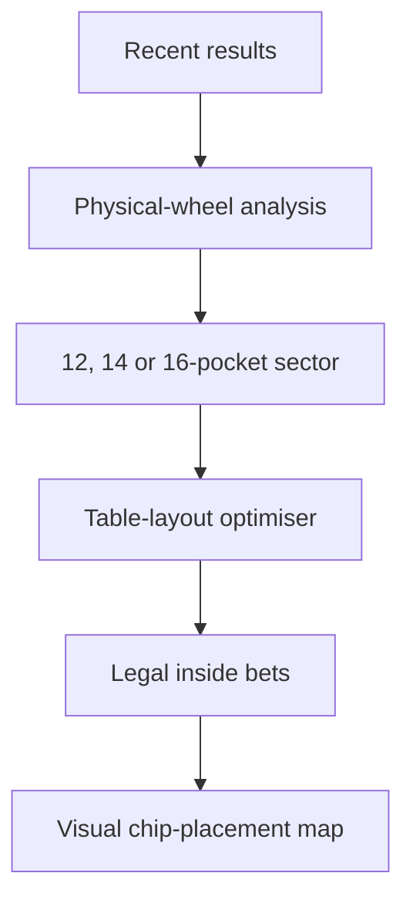

# Roulette JARVIS 🎰

**A mobile-first European roulette wheel-sector analyser and legal-bet ticket optimiser.**

[▶ Open the public interactive app/demo](https://roulette-jarvis.monferrer-m.chatgpt.site)

Roulette JARVIS maps recent results onto the physical European wheel, identifies the most active consecutive sector, and generates a legal inside-bet ticket that covers it completely.

The project is deliberately honest about probability: previous spins do not reliably predict the next result. It analyses observed clustering for entertainment while demonstrating circular-data analysis, betting-layout geometry, ticket optimisation, and payout modelling.

> **Portfolio status:** the application itself is the public interactive demo. It is hosted on ChatGPT Sites; this repository documents the product, mathematics, architecture, and design decisions.

## How it works

1. **Enter recent spins** using an interactive European roulette cloth.
2. **Analyse the physical wheel** and choose a sector of **12, 14, or 16 consecutive pockets**.
3. **Choose the allowed betting style** and a **€5 or €10 chip value**.
4. **Preview the ticket visually** as JARVIS places each chip on its exact position on the betting cloth.
5. **Lock the sector** and review the legal bets, coverage, cost, probability, and result-dependent returns.

## Betting styles

- **Plenos + Caballos**
- **Plenos + Caballos + Tercios**
- **Plenos + Caballos + Tercios + Cuartas**

JARVIS favours unique coverage inside the locked sector, penalises unnecessary outside coverage, avoids accidental overlaps, and never creates an illegal table bet. There is no maximum-chip input: the required chip count is calculated from the selected sector and legal bet shapes.

## Visual table intelligence

The app includes an original European roulette-table interface designed for fast mobile use:

- authentic green betting-cloth layout with vertical zero and the correct 3 × 12 number grid;
- one-tap recent-spin entry directly from the numbered pockets;
- live ticket preview during configuration;
- exact chip placement for every generated bet:
  - **pleno:** centre of one number;
  - **caballo:** shared line between two adjacent numbers;
  - **tercio:** edge shared by a three-number row;
  - **cuarta:** intersection shared by four numbers;
- €5 or €10 printed on each rendered chip;
- the same placement map repeated on the final **JARVIS SECTOR LOCKED** ticket;
- numbered visual chips matched to the exact-bets list.

This removes the need to translate an abstract bet list into table positions while standing at a roulette table.

## Key features

- European single-zero roulette, numbers `0–36`
- Correct physical European wheel order
- Recent-spin heat scoring and circular-sector analysis
- Selectable 12-, 14-, or 16-pocket sectors
- Legal plenos, caballos, tercios, and cuartas
- Automatic full-sector ticket generation
- Interactive roulette-cloth spin entry
- Live, geometrically accurate chip-placement preview
- Fixed €5 or €10 chip values displayed on the chips
- Calculated chips required and total ticket cost
- Complete covered-number set
- Per-number payout and net-result calculations
- Mobile-first casino-tech interface
- No Martingale, loss chasing, or “due a win” claims

## The central engineering distinction

Physical neighbours on the wheel are not automatically legal adjacent bets on the table.



Roulette JARVIS uses a **circular wheel model** for heat and sector selection, and a separate **betting-table geometry model** for validating legal bet shapes and rendering each chip at the correct position.

## Mathematics at a glance

A European wheel has 37 equally likely pockets.

```text
Probability of any covered result = unique covered numbers / 37
```

| Bet | Numbers | Payout | Gross return per chip |
|---|---:|---:|---:|
| Pleno | 1 | 35:1 | 36 × chip value |
| Caballo | 2 | 17:1 | 18 × chip value |
| Tercio | 3 | 11:1 | 12 × chip value |
| Cuarta | 4 | 8:1 | 9 × chip value |

Mixed tickets can produce different returns depending on the winning number and overlaps, so the app evaluates each covered result rather than showing one misleading universal payout.

See [The algorithm and mathematical model](docs/ALGORITHM.md).

## Documentation

- [Architecture and data flow](docs/ARCHITECTURE.md)
- [Algorithm and mathematical model](docs/ALGORITHM.md)
- [Responsible-use principles](docs/RESPONSIBLE-USE.md)
- [Product roadmap](docs/ROADMAP.md)

## Disclaimer

Roulette spins are independent under normal conditions. Recent outcomes do not make a number or sector more likely on the next spin. This is an entertainment and software-design demonstration, not a system for beating roulette. Only gamble where legal and use money you can afford to lose.

## Credits

**Designed and developed by Marc Monferrer with JARVIS.**

Built as a fun AI consulting portfolio case study in Barcelona.
