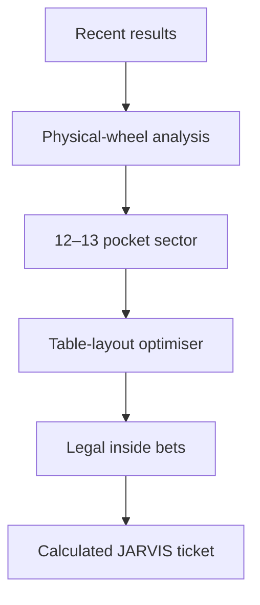

# Roulette JARVIS 🎰

**A mobile-first European roulette wheel-sector analyser and legal-bet ticket optimiser.**

[▶ Open the public interactive app/demo](https://roulette-jarvis.monferrer-m.chatgpt.site)

Roulette JARVIS turns recent roulette results into a visual map of the physical European wheel. It identifies the most active consecutive wheel sector and generates a legal inside-bet ticket for approximately one third of the wheel.

The project is deliberately honest about probability: previous spins do not reliably predict the next result. Roulette JARVIS analyses observed clustering for entertainment while demonstrating circular-data analysis, betting-layout logic, constrained optimisation, and payout modelling.

> **Portfolio status:** the application itself is the public, interactive demo. It is hosted on ChatGPT Sites; this repository documents the product, mathematics, architecture, and design decisions.

## What the app does

1. **Enter recent spins** using a mobile roulette-table keypad.
2. **Analyse the physical wheel** and view the strongest recent 12- or 13-pocket sector.
3. **Choose a betting style** and the maximum number and value of chips.
4. **Lock the sector** and receive exact legal bets, all covered numbers, cost, hit probability, and result-dependent payouts.

## Betting styles

The simplified configuration offers three progressively broader legal-bet combinations:

- **Plenos + Caballos** — straight-up numbers and legal two-number splits.
- **Plenos + Caballos + Tercios** — adds legal three-number streets.
- **Plenos + Caballos + Tercios + Cuartas** — adds legal four-number corner bets.

JARVIS automatically favours unique coverage inside the locked sector, penalises unnecessary outside coverage, avoids accidental overlaps, and never creates an illegal table bet.

## Key features

- European single-zero roulette, numbers `0–36`
- Correct physical European wheel order
- Recent-spin heat scoring and circular-sector analysis
- Twelve- or thirteen-pocket targeting—approximately one third of the wheel
- Separate validation for legal table bets
- Plenos, caballos, tercios, and cuartas
- Automatic balanced ticket generation
- Maximum chips and chip-value controls
- Complete covered-number set
- Per-number payout and net-result calculations
- Mobile-first casino-tech interface
- No Martingale, loss chasing, or “due a win” claims

## The central engineering distinction

Physical neighbours on the wheel are not automatically legal adjacent bets on the table.



Roulette JARVIS therefore uses two different models:

- a **circular wheel model** for heat, distance, neighbours, and consecutive sectors;
- a **betting-table model** for validating plenos, caballos, tercios, and cuartas.

## Mathematics at a glance

A European wheel has 37 equally likely pockets.

```text
Probability of any covered result = unique covered numbers / 37
```

| Bet | Numbers | Payout | Gross return per unit |
|---|---:|---:|---:|
| Pleno | 1 | 35:1 | 36 |
| Caballo | 2 | 17:1 | 18 |
| Tercio | 3 | 11:1 | 12 |
| Cuarta | 4 | 8:1 | 9 |

Mixed tickets can produce different returns depending on the winning number and overlaps, so the app evaluates every covered result rather than displaying one misleading universal payout.

```text
Net(n) = returns from all winning bets containing n − total ticket stake
```

See [The algorithm and mathematical model](docs/ALGORITHM.md) for more detail.

## Documentation

- [Architecture and data flow](docs/ARCHITECTURE.md)
- [Algorithm and mathematical model](docs/ALGORITHM.md)
- [Responsible-use principles](docs/RESPONSIBLE-USE.md)
- [Product roadmap](docs/ROADMAP.md)

## Portfolio value

This fun project demonstrates:

- circular-sector scoring;
- separation of physical-wheel and betting-table topology;
- legal inside-bet generation;
- constrained ticket optimisation;
- transparent probability and payout calculations;
- mobile interaction design;
- responsible gambling language;
- an entertaining JARVIS visual identity without misleading claims.

## Disclaimer

Roulette spins are independent under normal conditions. Recent outcomes do not make a number or sector more likely on the next spin. This project is an entertainment and software-design demonstration, not financial advice or a system for beating roulette. Only gamble where legal and use money you can afford to lose.

## Credits

**Designed and developed by Marc Monferrer with JARVIS.**

Built as a fun AI consulting portfolio case study in Barcelona.
