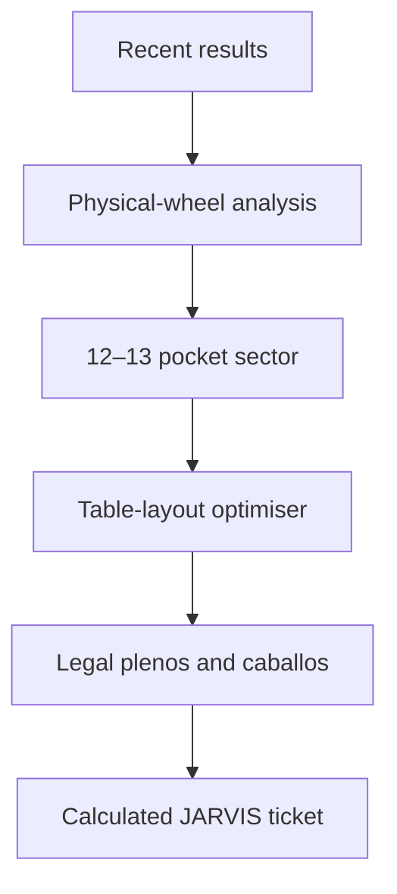

# Roulette JARVIS 🎰

**A mobile-first European roulette sector analyser and legal-bet ticket optimiser.**

[▶ Open the live interactive demo](https://roulette-jarvis.monferrer-m.chatgpt.site)

Roulette JARVIS turns recent roulette results into a visual map of the physical European wheel. It identifies the most active consecutive wheel sector and builds a legal ticket using straight-up bets (*plenos*), split bets (*caballos*), or a combination of both.

The project is deliberately honest about probability: previous spins do not reliably predict the next result. Roulette JARVIS analyses observed clustering for entertainment and demonstrates optimisation, circular-data analysis, payout modelling, and responsible UX.

> **Portfolio status:** the live application is currently hosted on ChatGPT Sites. This repository documents the product, architecture, maths, design decisions, and development roadmap. Application source will be mirrored here in a later release.

## What the demo does

1. **Enter recent spins** using a mobile roulette-table keypad.
2. **Analyse the wheel** and view a heatmap on the real European wheel order.
3. **Configure a ticket** with a sector size, strategy, bet composition, chip limit, and session limits.
4. **Lock the sector** and receive exact legal bets, covered numbers, cost, probability, and result-dependent payouts.

## Key features

- European single-zero roulette, numbers 0–36
- Correct physical wheel order and circular-sector analysis
- Twelve- or thirteen-pocket targeting (approximately one third of the wheel)
- Legal table-layout validation for *caballos*
- *Plenos*, *caballos*, and mixed tickets
- **Equal Coverage** and **Weighted Centre** strategies
- Duplicate-coverage detection and intentional weighting
- Per-number payout and net-result calculations
- Entertainment budget, chip value, and maximum-spin controls
- No Martingale, loss chasing, or “due a win” language
- Mobile-first casino-tech interface

## The central engineering distinction

Physical neighbours on the wheel are not automatically legal split bets on the table.



Roulette JARVIS therefore uses two separate models:

- a **circular wheel graph** for heat, distance, neighbours, and consecutive sectors;
- a **betting-table graph** for validating legal split bets.

## Mathematics at a glance

A European wheel has 37 equally likely pockets.

```
Probability of any covered result = unique covered numbers / 37
```

A straight-up bet pays 35:1 and a split pays 17:1. Mixed tickets can produce different returns depending on the winning number and overlaps, so the app evaluates every possible result rather than showing one misleading “winning payout.”

For a winning number `n`:

```
Net(n) = returns from all winning bets containing n − total ticket stake
```

See [The algorithm and mathematical model](docs/ALGORITHM.md) for details.

## Documentation

- [Architecture and data flow](docs/ARCHITECTURE.md)
- [Algorithm and mathematical model](docs/ALGORITHM.md)
- [Responsible-use principles](docs/RESPONSIBLE-USE.md)
- [Product roadmap](docs/ROADMAP.md)

## Technology direction

The planned portable implementation uses:

- Next.js, React, and TypeScript
- Tailwind CSS
- SVG for the interactive European wheel
- Pure TypeScript rules and optimisation modules
- Local device persistence
- Vitest for engine tests
- Playwright for mobile interaction tests
- PWA/offline support

The MVP is local-first: no account, database, real-money integration, or automated casino interaction is required.

## Project goals

This fun portfolio project demonstrates:

- circular-sector scoring;
- graph separation between wheel and table topology;
- constrained ticket optimisation;
- transparent probability and payout calculations;
- mobile interaction design;
- responsible gambling safeguards;
- an entertaining “JARVIS” visual identity without misleading claims.

## Disclaimer

Roulette spins are independent under normal conditions. Recent outcomes do not make a number or sector more likely on the next spin. This project is an entertainment and software-design demonstration, not financial advice or a system for beating roulette. Only gamble where legal, use money you can afford to lose, and stop at the limits chosen before the session.

## Credits

**Designed and developed by Marc Monferrer with JARVIS.**

Built as a fun AI consulting portfolio case study in Barcelona.
