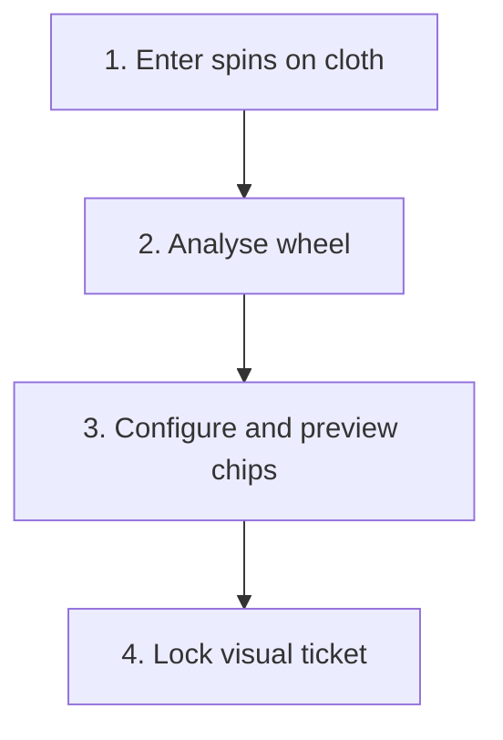

# Architecture

## Product flow



## System boundaries

| Layer | Responsibility |
|---|---|
| Presentation | Mobile steps, physical wheel, interactive cloth, configuration, visual ticket and outcomes |
| Local state | Spin history, sector size, betting style and chip value |
| Wheel engine | European order, circular distance, heat and 12/14/16-pocket scoring |
| Betting engine | Legal plenos, caballos, tercios, cuartas and full-sector coverage |
| Table geometry | Converts every legal bet into an exact chip coordinate on the roulette cloth |
| Maths engine | Chips required, ticket cost, probability and net results |
| Rules configuration | Casino-specific zero splits and future variants |

## Two distinct models

### Physical European wheel

```
0, 32, 15, 19, 4, 21, 2, 25, 17, 34, 6, 27, 13, 36, 11, 30,
8, 23, 10, 5, 24, 16, 33, 1, 20, 14, 31, 9, 22, 18, 29, 7,
28, 12, 35, 3, 26
```

This model supports circular distance, neighbour weighting, heatmap placement, and consecutive windows that wrap across zero.

### European betting table

The second model validates legal table shapes. A physical-wheel neighbour pair is not automatically a legal caballo.

The same table model powers two interfaces:

- the first-screen betting cloth, where numbered pockets act as one-tap spin-entry controls;
- the live and final ticket maps, where recommended chips are placed on exact betting positions.

## Chip-placement geometry

Each legal bet is translated from numbers into a visual anchor:

| Bet type | Visual anchor |
|---|---|
| Pleno | Centre of the selected number cell |
| Caballo | Midpoint of the shared boundary between two cells |
| Tercio | Centre of the outer edge shared by a legal three-number row |
| Cuarta | Intersection shared by four adjacent number cells |

The renderer then draws a numbered chip at that anchor and prints the selected €5 or €10 value on it. Because placement is derived from the validated bet definition, the visual map and exact-bets list cannot silently disagree.

## Optimiser contract

Inputs:

- selected 12-, 14-, or 16-pocket sector;
- one of the three allowed betting-style sets;
- €5 or €10 chip value.

Outputs:

- legal bet list;
- visual chip coordinates for the live cloth;
- automatically calculated chips required;
- total cost;
- selected sector and all unique covered numbers;
- result-by-result net calculations.

The optimiser cannot stop early: plenos provide a guaranteed legal fallback until every target pocket is covered.

## Testing priorities

1. Circular sectors wrap correctly.
2. All generated caballos, tercios, and cuartas are legal.
3. Every selected sector pocket is covered.
4. Every bet type maps to the correct cloth anchor.
5. Visual chips and the exact-bets list remain in the same order.
6. Chip value changes update every rendered chip.
7. Chip count equals the number of one-chip bets.
8. Cost is correct for both chip values.
9. Every pocket produces the correct gross return and net result.
10. Mobile controls and chip labels remain readable at narrow viewport widths.
