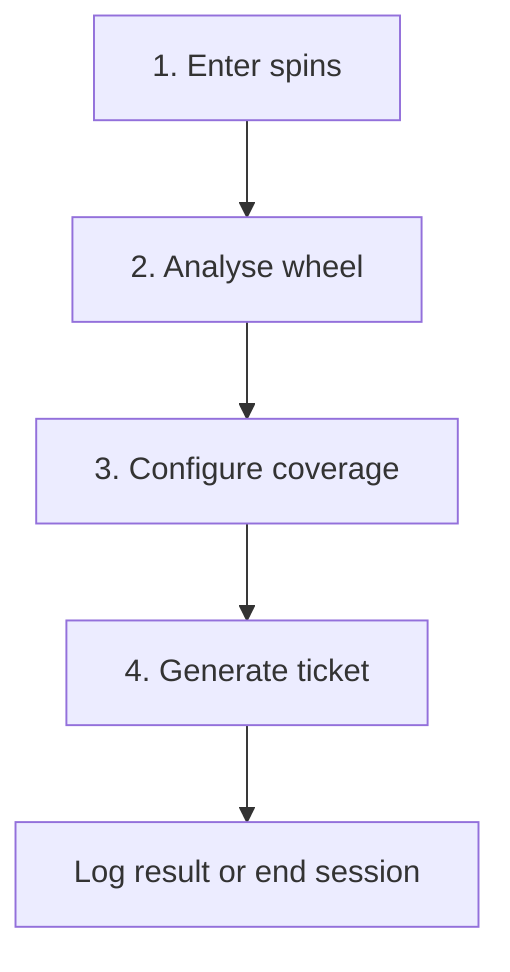

# Architecture

## Product flow



## System boundaries

Roulette JARVIS separates interface state from deterministic domain logic.

| Layer | Responsibility |
|---|---|
| Presentation | Mobile steps, wheel SVG, table keypad, ticket and outcomes |
| Session state | Spin history, settings, budget, spin count and current ticket |
| Wheel engine | European order, circular distance, heat and sector scoring |
| Betting engine | Legal plenos/caballos, coverage and ticket optimisation |
| Maths engine | Probability, gross returns, net results and exposure |
| Rules configuration | Casino-specific zero splits and future variants |
| Persistence | Local device storage only in the MVP |

## Two distinct graphs

### Physical European wheel

The canonical clockwise order is:

```
0, 32, 15, 19, 4, 21, 2, 25, 17, 34, 6, 27, 13, 36, 11, 30,
8, 23, 10, 5, 24, 16, 33, 1, 20, 14, 31, 9, 22, 18, 29, 7,
28, 12, 35, 3, 26
```

It supports circular distance, neighbour weighting, heatmap placement, and consecutive windows that wrap across zero.

### Betting table

For 1–36, a split is legal when the two numbers:

- differ by 3 vertically; or
- differ by 1 horizontally without crossing a row boundary.

Zero splits are configuration because table rules can vary. The application must never infer that two wheel neighbours form a legal split.

## Suggested portable module layout

```
app/          Mobile step routes and layout
components/   Wheel, table, ticket and session UI
core/wheel/   Circular order, heat and sector analysis
core/betting/ Legal bets, strategies and optimiser
core/maths/   Probability and payouts
core/session/ Budget and spin-limit rules
config/       Casino-specific rules
store/        Local session state
tests/        Rules, optimiser and payout tests
docs/         Portfolio and engineering documentation
```

## Local-first rationale

- Works with weak venue connectivity.
- Requires no account or database.
- Keeps session information on the device.
- Minimises operational cost and deployment complexity.
- Makes the demo easy to test without real-money integration.

## Testing priorities

1. All generated caballos are legal.
2. Circular windows wrap correctly.
3. Unique coverage is calculated without accidental duplication.
4. Tickets never exceed the configured chip limit.
5. Every pocket produces the correct gross return and net result.
6. Budget limits block overexposure.
7. Mobile controls remain usable at narrow viewport widths.
