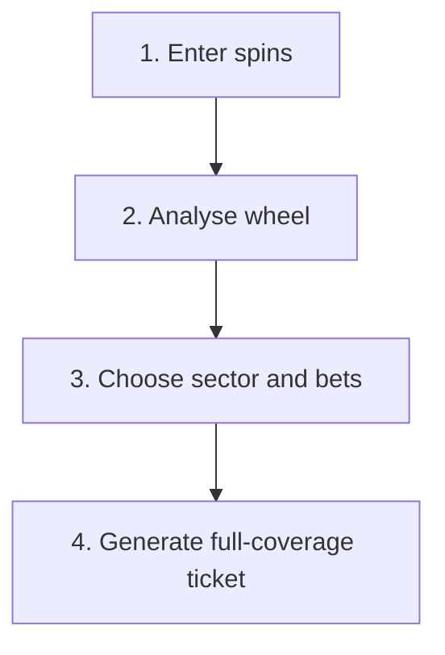

# Architecture

## Product flow



## System boundaries

| Layer | Responsibility |
|---|---|
| Presentation | Mobile steps, wheel, keypad, configuration, ticket and outcomes |
| Local state | Spin history, sector size, betting style and chip value |
| Wheel engine | European order, circular distance, heat and 12/14/16-pocket scoring |
| Betting engine | Legal plenos, caballos, tercios, cuartas and full-sector coverage |
| Maths engine | Chips required, ticket cost, probability and net results |
| Rules configuration | Casino-specific zero splits and future variants |

## Two distinct models

### Physical European wheel

```
0, 32, 15, 19, 4, 21, 2, 25, 17, 34, 6, 27, 13, 36, 11, 30,
8, 23, 10, 5, 24, 16, 33, 1, 20, 14, 31, 9, 22, 18, 29, 7,
28, 12, 35, 3, 26
```

This model supports circular distance, neighbour weighting, heatmap placement, and consecutive windows that wrap across zero.

### European betting table

The second model validates legal table shapes. A physical-wheel neighbour pair is not automatically a legal caballo.

## Optimiser contract

Inputs:

- selected 12-, 14-, or 16-pocket sector;
- one of the three allowed betting-style sets;
- €5 or €10 chip value.

Outputs:

- legal bet list;
- automatically calculated chips required;
- total cost;
- selected sector and all unique covered numbers;
- result-by-result net calculations.

The optimiser cannot stop early: plenos provide a guaranteed legal fallback until every target pocket is covered.

## Testing priorities

1. Circular sectors wrap correctly.
2. All generated caballos, tercios, and cuartas are legal.
3. Every selected sector pocket is covered.
4. Chip count equals the number of one-chip bets.
5. Cost is correct for both chip values.
6. Every pocket produces the correct gross return and net result.
7. Mobile controls remain usable at narrow viewport widths.
